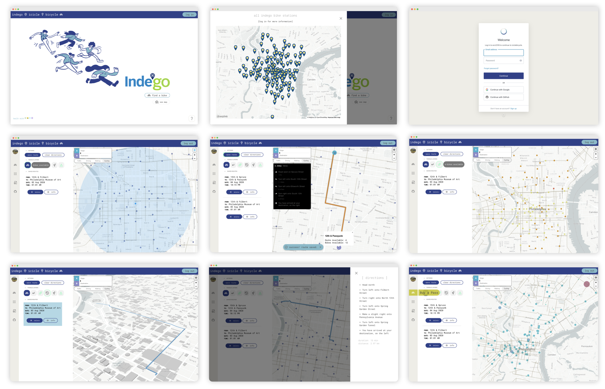

# indego icicle bicycle

## what

an app that allows users to:

- view indego bike share stations across philly
- get directions to & from stations/ origin/ destination
- get directions to & from stations/ origin/ destination
- toggle map layers on & off

## why

- indego bike share is the best way to get around/ explor the city imo. (all the more so during covid-19)
- the existing indego app is great, but i've found myself having to switch between the indego app and google maps trying to figure out:
  - where the indego stations are
  - directions from where i am to the station
  - directions between stations
  - directions from the station to my destination

## ok, then what?

- this is an attempt to take select functions from each app and combine them for easier trip planning
- using this app, users should be able to identify stations AND get directions between stations/ origin/ destination.

## how

- Auth0
- Axios
- Express.js
- Grommet
- Mapbox GL JS + directions API plugin
- MongoDB + Mongoose + mLab
- Node.js
- React

## demo

[deployed to heroku](https://indegoiciclebicycle.herokuapp.com/)
